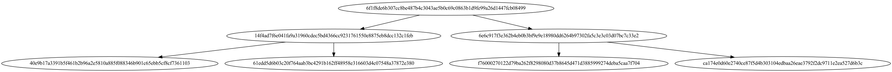

# **Lab 1**

This repository contains two implementations related to cryptography and blockchain concepts:
1. **Merkle Tree Construction and Visualization** (Exercise 1)
2. **Proof of Work Simulation** (Exercise 2)

## **Prerequisites**

Make sure you have the following installed on your system:
- C++ Compiler (GCC or Clang)
- OpenSSL library
- Graphviz (for Merkle Tree visualization)
- A terminal environment (MacOS/Linux or WSL for Windows)

### **OpenSSL Installation**
On MacOS, you can install OpenSSL using Homebrew:
```bash
brew install openssl@3
```
### **Graphviz Installation**
To visualize the Merkle Tree, Graphviz is required. Install it via Homebrew:
```bash
brew install graphviz
```
## **Exercise 1: Merkle Tree**

This exercise constructs a Merkle Tree from given data blocks and generates a visual representation of the tree using Graphviz.
Code Explanation
Merkle_Tree.cpp
- Constructs a Merkle Tree by hashing data blocks and combining them up to the root hash.
- Generates a .dot file representing the Merkle Tree structure.
- Uses SHA256 to compute the hashes of the data blocks.
- The resulting tree is saved as merkle_tree.dot and can be converted to an image format for visualization.

How to Compile and Run

1.	Navigate to the Exercice1 directory:
```bash
cd Exercice1
```

2.	Compile the code with the following command:
```bash
g++ Merkle_Tree.cpp -o Merkle_Tree -I/opt/homebrew/opt/openssl@3/include -L/opt/homebrew/opt/openssl@3/lib -lssl -lcrypto -Wno-deprecated-declarations -std=c++11
```
3.	Run the program:
```bash
./Merkle_Tree
```
This will generate the Merkle Tree structure and save it to merkle_tree.dot.

4.	To visualize the tree, convert the DOT file to PNG using Graphviz:
```bash
dot -Tpng merkle_tree.dot -o merkle_tree.png
```
Result



## **Exercise 2: Proof of Work**

This exercise simulates the Proof of Work (PoW) mechanism, which is a fundamental concept in blockchain technology. The program creates and mines blocks with different hash difficulties, measuring the time taken to mine each block.
Code Explanation
Proof_of_Work.cpp:
- Defines a simple Block structure containing block data, a hash, and a nonce.
- Implements the mining process by incrementing the nonce until a valid hash (based on the difficulty) is found.
- Prints the mined block’s hash and the time taken to find the correct hash.

How to Compile and Run

1.	Navigate to the Exercice2 directory:
```bash
cd Exercice2
```

2.	Compile the code using the following command:
```bash
g++ Proof_of_Work.cpp -o Proof_of_Work -I/opt/homebrew/opt/openssl@3/include -L/opt/homebrew/opt/openssl@3/lib -lssl -lcrypto -Wno-deprecated-declarations -std=c++11
```
3.	Run the program:
```bash
./Proof_of_Work
```
Result
The program will output information about each block mined:
- **Block Number**: Indicates the block being mined.
- **Mined Block Hash**: Displays the final hash that satisfies the difficulty constraint.
- **Time Taken**: Shows the time (in seconds) required to mine the block at the specified difficulty level.

Example output:
```bash
Ajout du bloc 1...
Block miné : 00005e8eed870023600ffeba9a3635c4f3901bd5401553e8770a16a26c01a9ed
Temps pour miner : 0.383109 secondes

Ajout du bloc 2...
Block miné : 0000a8c430e2933efacce9edf522cdf4faf159578fc838375af289a821da8381
Temps pour miner : 0.222228 secondes

Ajout du bloc 3...
Block miné : 0000a266db24faac58a5aa82c13a13cf38cbcda7fd2ea54b169b125f59d4bb15
Temps pour miner : 0.398183 secondes
```

Understanding the Results:

•	The mined block hash starts with a number of zeros determined by the difficulty level (harder difficulties require more leading zeros).
•	Mining time increases as the difficulty of the hash increases because it takes more attempts to find a valid hash that meets the condition.
