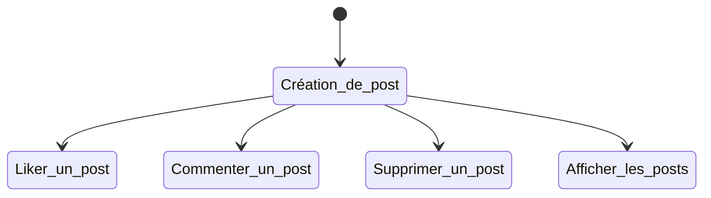

# Mini Réseau Social - Contrat Intelligent Solidity

Ce projet vise à développer un contrat intelligent "Mini Réseau Social" en utilisant le langage de programmation Solidity. Ce contrat permettra aux utilisateurs de publier, commenter et interagir avec des messages sur une blockchain.

## Objectifs
Les objectifs principaux de ce projet sont les suivants :
- Créer une structure de données pour stocker les messages publiés par les utilisateurs.
- Développer des fonctions permettant aux utilisateurs de publier, commenter et interagir avec les messages.
- Implémenter des mécanismes de sécurité et de gestion des autorisations.
- Tester le contrat intelligent sur un réseau de test.

## Diagramme de flux
Voici un diagramme de flux Mermaid pour représenter les principales fonctionnalités du contrat intelligent :

## Implémentation
Voici les principales étapes d'implémentation du contrat intelligent :

### 1. Déclaration du contrat intelligent
Nous commençons par déclarer le contrat intelligent "MiniSocial" en Solidity.

### 2. Structures de données
Nous définissons deux structures de données principales :
- `Comment` : pour stocker les commentaires des utilisateurs sur les messages.
- `Post` : pour stocker les informations relatives à chaque message publié.

### 3. Fonctions principales
Nous implémentons les principales fonctions du contrat intelligent :
- `createPost` : permet aux utilisateurs de publier un nouveau message.
- `addComment` : permet aux utilisateurs d'ajouter un commentaire à un message existant.
- `toggleLike` : permet aux utilisateurs de liker ou dé-liker un message.
- `getPost` : permet de récupérer les détails d'un message spécifique.
- `getAllPosts` : permet de récupérer la liste de tous les messages actifs.
- `getTotalPosts` : permet de récupérer le nombre total de messages publiés.
- `hasLiked` : permet de vérifier si un utilisateur a liké un message.
- `deletePost` : permet à l'auteur d'un message de le supprimer.

## Utilisation
Pour utiliser le contrat intelligent, vous pouvez le déployer sur un réseau de test Ethereum, comme Sepolia, en utilisant l'IDE Remix.

1. Ouvrez Remix IDE (https://remix.ethereum.org/).
2. Créez un nouveau fichier "MiniSocial.sol" et copiez-y le code du contrat intelligent.
3. Compilez le contrat en sélectionnant la version de Solidity appropriée (^0.8.0).
4. Déployez le contrat sur le réseau de test Sepolia.
5. Interagissez avec le contrat en utilisant les différentes fonctions implémentées.

## Conclusion
Le contrat intelligent "Mini Réseau Social" implémenté en Solidity offre les fonctionnalités de base d'un réseau social décentralisé. Les utilisateurs peuvent publier des messages, commenter, liker/dé-liker, et consulter la liste des messages actifs. Des mécanismes de sécurité et de gestion des autorisations sont également mis en place, permettant notamment aux auteurs de supprimer leurs propres messages.

Ce projet peut être étendu à l'avenir avec des fonctionnalités supplémentaires, telles que la modification des messages, la notification des utilisateurs, ou encore l'intégration de jetons non fongibles (NFT) pour représenter les messages publiés.

## 👨‍💻 Auteur
- **DAGHMOUMI Marouan**
  - MST: Intelligence Artificielle et Science des Données
  - Faculté des Sciences et Techniques - Tanger
  - Université Abdelmalek Essaâdi

### Encadré par
- **Pr. Ikram Ben abdel ouahab**

---
*Ce projet est développé dans le cadre du cours de Blockchain à la FST de Tanger.*
