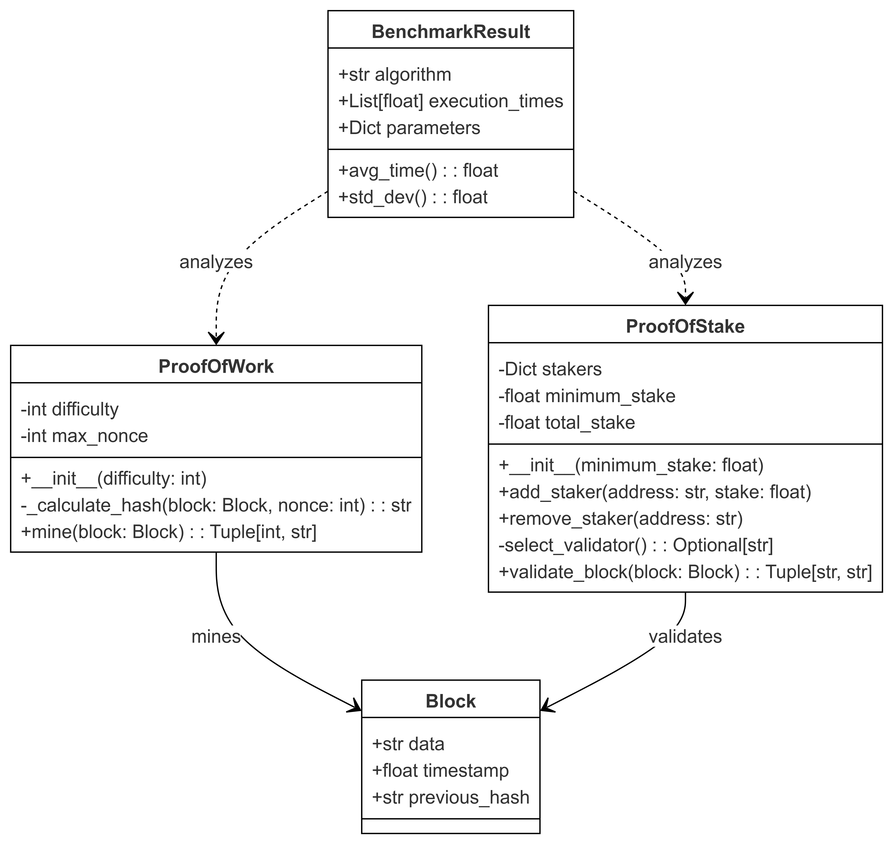

# Blockchain Consensus Mechanisms Benchmark
Une implémentation Python pour comparer les performances des algorithmes de consensus Proof of Work (PoW) et Proof of Stake (PoS).

## 🔍 Qu'est-ce que ce projet ?
Ce projet implémente et compare deux mécanismes de consensus blockchain majeurs :
- **Proof of Work (PoW)** : Système basé sur la résolution de puzzles cryptographiques
- **Proof of Stake (PoS)** : Système basé sur la mise (stake) des validateurs
- Inclut des outils de benchmarking complets pour comparer leurs performances
## 📥 Clone du projet
```bash
git clone https://github.com/Marouan19/Blockchain_labs.git
cd "Blockchain_labs/Benchmarking_PoW_&_PoS"
```

## 🏗️ Structure du Projet
### 1. Classes Principales
#### Block
```python
@dataclass
class Block:
    data: str
    timestamp: float
    previous_hash: str = ""
```

#### ProofOfWork
```python
class ProofOfWork:
    def __init__(self, difficulty: int):
        self.difficulty = difficulty
        self.max_nonce = 2 ** 32
```

#### ProofOfStake
```python
class ProofOfStake:
    def __init__(self, minimum_stake: float = 1.0):
        self.stakers: Dict[str, float] = {}
        self.minimum_stake = minimum_stake
        self.total_stake: float = 0
```

## 🔧 Fonctionnalités Principales

### 1. Proof of Work
- **Initialisation** : Définition de la difficulté (nombre de zéros requis)
- **Minage** : 
  - Recherche d'un nonce valide
  - Calcul de hash SHA-256
  - Vérification du critère de difficulté

### 2. Proof of Stake
- **Gestion des Validateurs** :
  - Ajout/retrait de validateurs
  - Gestion des mises (stakes)
- **Validation** :
  - Sélection pondérée des validateurs
  - Validation des blocs

## 📊 Résultats d'Exécution

### Résultats Proof of Work
```plaintext
Nonce trouvé: 5858
Hash généré: 000049b5a9ba4e09b6dc6d40c1e3583d1654061fad84f77156e9d7b4fac95327
Temps d'exécution: 0.0040 secondes
```

### Résultats Proof of Stake
```plaintext
Validateur sélectionné: Address3
Données du bloc: Sample Block Data
Temps d'exécution: 0.0000 secondes
```

### Analyse Comparative
- **Temps d'exécution** :
  - PoW : 4 millisecondes
  - PoS : temps négligeable (<1 milliseconde)
- **Caractéristiques** :
  - Le PoW nécessite un calcul intensif (5858 itérations)
  - Le PoS est quasi instantané
  - Le hash PoW commence bien par 4 zéros (difficulté=4)

## 📈 Visualisation du Processus

```
Proof of Work
│
├─ Entrée: Block Data
├─ Difficulté: 4 zéros
├─ Itérations: 5858
└─ Sortie: 000049b5...

Proof of Stake
│
├─ Entrée: Block Data
├─ Validateurs disponibles
├─ Sélection: Address3
└─ Validation instantanée
```

## 🛠️ Comment Exécuter

```bash
# Activation de l'environnement virtuel
source .venv/bin/activate

# Exécution du script
python Benchmarking_PoW_&_PoS./Exercice3.py
```

## 🔄 Exemple d'Utilisation

```python
# Configuration et exécution du PoW
pow = ProofOfWork(difficulty=4)
test_block = Block(
    data="Sample Block Data",
    timestamp=time.time(),
    previous_hash="0" * 64
)
nonce, pow_hash = pow.mine(test_block)

# Configuration et exécution du PoS
pos = ProofOfStake(minimum_stake=5.0)
pos.add_staker("Address1", 10.0)
pos.add_staker("Address2", 20.0)
pos.add_staker("Address3", 30.0)
validator, result = pos.validate_block(test_block)
```

## 👨‍💻 Auteur
- **DAGHMOUMI Marouan**
  - MST: Intelligence Artificielle et Science des Données
  - Faculté des Sciences et Techniques - Tanger
  - Université Abdelmalek Essaâdi

### Encadré par
- **Pr. Ikram Ben abdel ouahab**

## 📝 Conclusions
- Le PoW démontre une complexité calculatoire significative
- Le PoS offre une validation quasi instantanée
- Les résultats confirment l'efficacité énergétique du PoS par rapport au PoW
- Le temps de calcul du PoW augmente avec la difficulté

---
*Pour plus d'informations sur les autres ateliers Blockchain, visitez le [dépôt principal](https://github.com/Marouan19/Blockchain_labs).*
