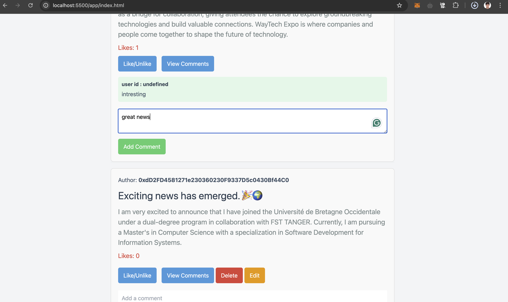

# Mini Social Media dApp

A decentralized social media application built on Ethereum blockchain that enables users to create, like, comment on, and manage posts in a decentralized way.

## 📑 Table of Contents
- [Overview](#overview)
- [Features](#features)
- [Project Structure](#project-structure)
- [Tech Stack](#tech-stack)
- [Screenshots](#screenshots)
- [Smart Contract](#smart-contract)
- [Getting Started](#getting-started)
- [Local Development](#local-development)

## Overview

Mini Social Media dApp is a Web3 social platform that demonstrates decentralized content management and user interactions. Users connect their MetaMask wallet to authenticate and interact with posts stored on the Ethereum blockchain.

## Features

- **🔐 Web3 Authentication**
  - MetaMask wallet integration
  - Secure wallet-based login
  - Account switching support
  
- **📝 Post Management**
  - Create new posts
  - Edit existing posts
  - Delete posts
  - Like/unlike functionality
  
- **💭 Social Interaction**
  - Comment on posts
  - View engagement metrics
  
- **👤 User Features**
  - Wallet address display
  - Post ownership verification
  - Post author tracking

## Project Structure

```
Mini_social_media/
├── contracts/
│   └── MiniSocial.sol    # Main smart contract
├── artifacts/            # Contract compilation artifacts
│   └── ...
└── my_webapp/           # Frontend application
    ├── index.html       # Login page
    ├── app/
    │   └── index.html   # Main application page
    ├── css/
    │   └── style.css
    └── js/
        ├── login.js     # Authentication logic
        └── app.js       # Main application logic
```

## Tech Stack

- **Frontend**:
  - HTML5
  - CSS
  - JavaScript
  - Tailwind CSS (for styling)

- **Blockchain**:
  - Solidity (Smart Contract)
  - Hardhat (Development Environment)
  - Ethers.js (Blockchain Interaction)

- **Authentication**:
  - MetaMask

## Screenshots

### Login Page

- MetaMask connection interface
- Wallet address display
- Login button

### Main Application

- Post creation form
- Post feed interface
- Post actions (edit, delete)
- Comments section

### User Interactions


- Creating a new post
- Commenting on posts
- Deleting posts
- Post engagement

## Smart Contract

The `MiniSocial.sol` contract manages all blockchain interactions:

```solidity
struct Post {
    uint256 postId;
    string title;
    string content;
    address author;
    uint256 timestamp;
    uint256 likesCount;
    Comment[] comments;
    bool isDeleted;
    bool isEdited;
    bool isCommented;
}

struct Comment {
    string content;
    address author;
    uint256 timestamp;
}
```

## Getting Started

1. **Prerequisites**:
   ```bash
   # Install Node.js and npm
   # Install MetaMask browser extension
   ```

2. **Installation**:
   ```bash
   # Clone the repository
   git clone [your-repository-url]

   cd Mini_social_media

   # Install dependencies
   npm install

   # Install Hardhat
   npm install --save-dev hardhat
   ```

## Local Development

1. **Compile Smart Contract**:
   ```bash
   npx hardhat compile
   ```

2. **Start Local Blockchain**:
   ```bash
   npx hardhat node
   ```

3. **Deploy Contract**:
   ```bash
   npx hardhat run scripts/deploy.js --network localhost
   ```

4. **Start Frontend**:
   ```bash
   # Navigate to webapp directory
   cd my_webapp

   # Start a local server (you can use any local server)
   # For example, using Python's built-in server:
   python -m http.server 8000
   # Or using Node's http-server:
   npx http-server
   ```

5. **Configure MetaMask**:
   - Connect to localhost:8545 network
   - Import test accounts if needed
   - Use the correct contract address

## Key Files

- `contracts/MiniSocial.sol`: Main smart contract containing all blockchain logic
- `my_webapp/index.html`: Login page with MetaMask integration
- `my_webapp/app/index.html`: Main application interface
- `my_webapp/js/app.js`: Frontend JavaScript handling contract interactions

## Usage Guide

1. **Connect Wallet**:
   - Click "Connect Wallet" on the login page
   - Approve MetaMask connection
   - Your wallet address will be displayed

2. **Create Post**:
   - Fill in the post content
   - Click "Create Post"
   - Confirm transaction in MetaMask

3. **Interact with Posts**:
   - Like posts by clicking the like button
   - Add comments using the comment form
   - Edit/delete your own posts using the respective buttons

4. **Change Account**:
   - Use the "Change Account" button to switch between different MetaMask accounts
   - The interface will update to show the new account's posts and interactions
   
## 👨‍💻 Auteur
- **DAGHMOUMI Marouan**
  - MST: Intelligence Artificielle et Science des Données
  - Faculté des Sciences et Techniques - Tanger
  - Université Abdelmalek Essaâdi

### Encadré par
- **Pr. Ikram Ben abdel ouahab**


---
*Pour plus d'informations sur les autres ateliers Blockchain, visitez le [dépôt principal](https://github.com/Marouan19/Blockchain_labs).*